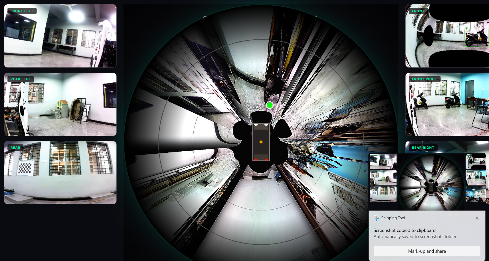

# SurroundView-ADAS: Real-Time Multi-Camera Bird's Eye View Perception System



## Project Overview

**SurroundView-ADAS** is a real-time Advanced Driver Assistance System (ADAS) that fuses six fisheye camera streams into a seamless 360° Bird's Eye View using homography-based image stitching, Gaussian blending, and YOLOv8 object detection. Designed to process data from ROS 2 bags, this system provides unparalleled spatial awareness for autonomous and assisted driving applications.

## Features

- **Multi-Camera Fusion**: Seamlessly stitches 6 fisheye camera feeds (front, front-left, front-right, rear, rear-left, rear-right) into a unified top-down perspective.
- **Advanced Computer Vision**: Real-time object detection using YOLOv8, projecting identified objects directly onto the Bird's Eye View (BEV) plane.
- **High-Fidelity Blending**: Utilizes Gaussian blending for smooth transitions between camera boundaries.
- **Batch Processing**: Robust pipeline for processing large ROS 2 bag datasets and generating continuous MP4 video outputs.
- **Web Dashboard**: An interactive Flask-based UI for real-time visualization, telemetry, and system monitoring.

## System Architecture

The architecture consists of three core components:
1. **Data Ingestion**: High-speed reading of camera frames from ROS 2 (`.db3`) bag files using the `rosbags` library.
2. **Perception & Geometry Engine**: 
   - Uses pre-calibrated intrinsic/extrinsic parameters for distortion removal.
   - Applies perspective transformations (homography) to map camera planes to the ground plane.
   - Runs YOLOv8 inference for bounding box extraction.
3. **Visualization & UI**: Flask serves a low-latency web dashboard displaying the final stitched image with overlaid telemetry and detection data.

## Pipeline

1. **Undistortion**: Raw fisheye images are corrected using camera matrix and distance coefficients.
2. **Projection**: Images are warped to a common BEV coordinate system.
3. **Detection**: YOLOv8 detects vehicles, pedestrians, and obstacles.
4. **Stitching & Blending**: Projected images are fused with weighting masks to eliminate harsh seams.
5. **Overlay**: Bounding boxes and telemetry are drawn on the final BEV map.
6. **Output**: Resulting frames are either served via the web interface or encoded into video files.

## Folder Structure

```
SurroundView-ADAS/
├── data/                    # Configuration and camera calibration parameters
├── modules/                 # Core computer vision engine
│   ├── geometry.py          # Geometric transformations & stitching
│   └── perception.py        # YOLOv8 object detection wrapper
├── output/                  # Generated debug images and samples
├── output_demo/             # Generated video demos
├── ui/                      # Web dashboard assets (HTML/CSS)
├── ztp_ui/                  # Zero-touch provisioning UI components
├── app.py                   # Main Flask web application
├── batch_process_bev.py     # Script to convert ROS bags to BEV videos
├── main.py                  # Core processing script
├── monitor_progress.py      # Batch processing monitor
├── start_batch_processing.py# CLI launcher for batch tasks
├── requirements.txt         # Python dependencies
└── README.md                # Project documentation
```

## Installation

### Prerequisites
- Python 3.8 or higher
- Git

### Setup

1. **Clone the repository:**
   ```bash
   git clone https://github.com/sivas123456/SurroundView-ADAS.git
   cd SurroundView-ADAS
   ```

2. **Create a virtual environment (Optional but recommended):**
   ```bash
   python -m venv venv
   source venv/bin/activate  # On Windows use: venv\Scripts\activate
   ```

3. **Install dependencies:**
   ```bash
   pip install -r requirements.txt
   ```

### Dataset Preparation

To test the application, you will need the `.db3` ROS bag datasets, which are hosted externally due to their large size.
1. Download the required `.db3` ROS bag files from this [Google Drive Link](https://drive.google.com/drive/u/1/folders/134i_1ITzETs3Ime3BUQ9yP9zn21O06Gj).
2. Place the downloaded `.db3` files directly into the root directory of this project (`SurroundView-ADAS/`).

## Dependencies
- `opencv-python` (cv2)
- `numpy`
- `rosbags`
- `flask`
- `ultralytics` (YOLOv8)

## Usage

### Web Dashboard
To launch the real-time visualization and telemetry dashboard:
```bash
python app.py
```
Then, open your web browser and navigate to `http://localhost:5000`.

### Batch Processing
To process large `.db3` ROS bags into MP4 video outputs:
```bash
python start_batch_processing.py
```
You can monitor the progress of the batch tasks by running:
```bash
python monitor_progress.py
```

## Technical Details
- **Camera Configuration**: 6 fisheye cameras covering 360 degrees.
- **Stitching Mechanism**: Pre-computed weight matrices are used to blend overlapping regions linearly, significantly reducing computational overhead during real-time inference.
- **Deep Learning Model**: YOLOv8 Nano (`yolov8n.pt`) optimized for edge deployment.

## Technologies Used
- **Python 3**
- **OpenCV**: Core image processing and matrix transformations.
- **YOLOv8 (Ultralytics)**: Object detection.
- **Flask**: Web server and streaming interface.
- **ROSBags**: Reading ROS 2 data formats natively without a full ROS installation.

## Future Improvements
- **GPU Acceleration**: Implement TensorRT and CUDA optimizations for OpenCV operations to increase FPS.
- **Sensor Fusion**: Integrate LiDAR point clouds with the visual BEV map.
- **Temporal Tracking**: Add DeepSORT to track objects consistently across frames.
- **Dynamic Calibration**: Implement online auto-calibration for camera drift.

## License
This project is licensed under the MIT License - see the [LICENSE](LICENSE) file for details.
